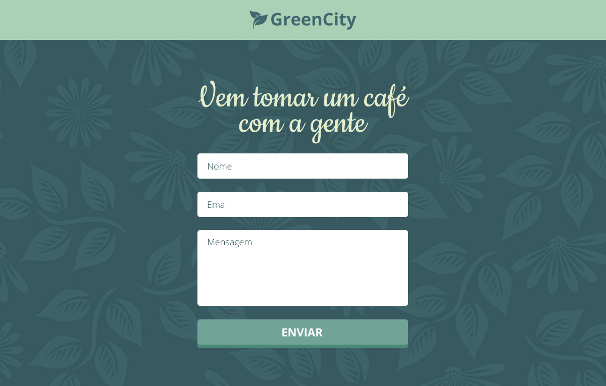

# Estágio Front-end @ Advance
Esse é um teste para candidat@s à vaga de estágio em desenvolvimento Front-end na Advance.

## Sua tarefa
Você precisa implementar a seguinte interface utilizando HTML, CSS e JavaScript:

Você precisa implementar:
* A página completa e todos os seus detalhes.
* Um sistema simples de validação (detalhado abaixo).

Você pode analisar melhor a interface pelas imagens contidas na pasta `specs`. O arquivo
`01-SPECS.jpg` contém referências da interface como fontes, cores e outros detalhes visuais.

Não é necessário criar um back-end para receber as informações do formulário de contato.
Além disso, você não precisa de conhecimentos sobre JavaScript: parte do código necessário 
já está escrito, e seu código pode se basear nele. Não julgaremos seu conhecimento em 
JavaScript, apenas seu domínio em lógica de programação.

## Definições
Essa é uma página simples para um restaurante fictício, e @s usuári@s do site podem enviar
mensagens via um formulário de contato. 

@ usuári@ deve preencher seu nome, endereço de email e escrever uma mensagem. Ao clicar no
botão de envio, os dados devem ser lidos usando Javascript e um alerta deve mostrar uma 
mensagem de sucesso ou listar os campos que não foram preenchidos pelo usuário.

A validação **não** deve ser feita utilizando a propriedade `required` nos campos de texto. O
arquivo `main.js` contém dicas sobre como pegar os dados dos campos e verificar
se eles foram preenchidos. Lembre-se: nós não analisaremos seu nível de conhecimento
em JavaScript, então não se preocupe em aprender JavaScript avançado para fazer esse teste.

Caso você não conheça JavaScript, dê uma olhada rápida nesses dois artigos e você aprenderá
o necessário para fazer esse teste:

* [Armazenando informações em variáveis — MDN](https://developer.mozilla.org/pt-BR/docs/Learn/JavaScript/First_steps/Vari%C3%A1veis)
* [Utilizando estruturas de controle — MDN](https://developer.mozilla.org/pt-BR/docs/Aprender/JavaScript/Elementos_construtivos/conditionals)

## Como fazer o seu teste
1. Crie um fork desse repositório
2. Clone o repositório na sua máquina
3. Faça sua mágica 🌈
4. Faça commit do seu código e suba para o GitHub
5. Responda ao seu email de convite com o link do repositório com seu código

Não há necessidade de criar um pull request com o seu código. Todos os testes devem ser 
enviados a nós via email.

Esse projeto já contém uma base para te ajudar a começar seu código rapidamente.

* O arquivo `index.html` contém a estrutura básica do formulário. Você pode alterá-la
livremente caso ache necessário.
* O arquivo `main.css` contém as fontes necessárias (carregadas via Google Fonts) e já
é carregado pelo `index.html`.
* O arquivo `main.js` contém exemplos de como selecionar elementos no DOM, pegar os 
valores dos campos do formulário e mostrar alertas para o usuário. Esse arquivo também
já está sendo carregado pelo `index.html`.

Você tem toda a liberdade de alterar qualquer parte desses arquivos caso ache necessário. 
Nós escrevemos essa base apenas para agilizar o processo de criação do boilerplate do site.

## O que nós esperamos
Em resumo, nós esperamos um código limpo, de fácil manutenabilidade, legível e organizado
acima de tudo. Porém, nós também esperamos que você:

### HTML
* Faça bom uso das tags semânticas do HTML.
* Escreva código compatível com as especificações do HTML5.
* Crie uma árvore de elementos bem estruturada, sem elementos desnecessários.

### CSS
* Nomeie os seletores de maneira clara e concisa.
* Faça bom uso do CSS. Você pode utilizar recursos recentes como Flexbox, Grid, 
Custom Properties, etc.

### JavaScript
* Faça bom uso de lógica de programação. Lembre-se: não iremos julgar seu conhecimento 
em JavaScript, apenas seu domínio em lógica de programação.
* Escreva código simples e de fácil compreensão.

### Layout/Design
* Crie uma interface final o mais próximo possível das imagens disponibilizadas na pasta
`specs`. Observe bem os detalhes como fontes, cores, margens e espaçamentos.

### Git
* Use o git. 👀
* Escreva mensagens de commit úteis, porém compactas.
